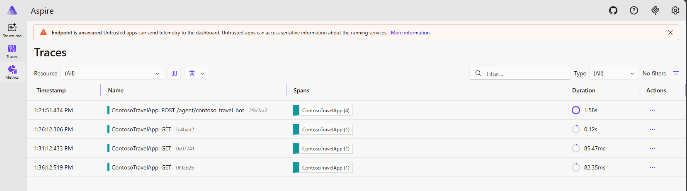
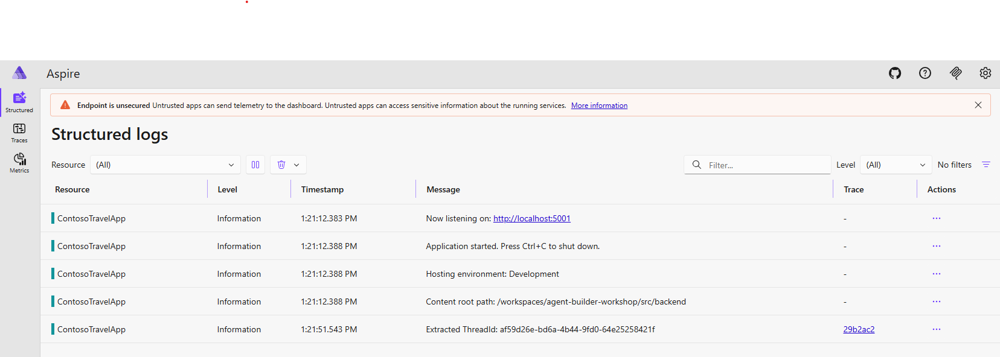

# Lab 4: See Under the Hood - Observability

In this lab, you'll implement observability and tracing for your AI travel agent using OpenTelemetry. You'll learn how to monitor agent operations, track tool calls, and visualize the entire execution flow to understand and debug your agent's behavior.

By the end of this lab, you will:

- ✅ Enable OpenTelemetry tracing for your AI agent
- ✅ Monitor agent operations and tool calls in real-time
- ✅ Visualize execution flow using AI Toolkit's trace viewer
- ✅ Understand how to debug and optimize agent performance

---

## The Problem: Black Box Agents

```text

👤 User: Find me flights to Tokyo under $800

🤖 Agent: Here are some flights...

```

Without observability, debugging AI agents wil be a challenge. You would have no insight into:

- ❌ What inputs were sent to the LLM?
- ❌ How long did each operation take?
- ❌ Which tools were called, with what parameters?
- ❌ What was the exact sequence of operations?

---

## Instructions

### Step 1: Locate the Source Code

Navigate to the backend project:

``` text

📁 src/backend/

```

You will be modifying the code in this directory to enable observability and tracing.

### Step 2: Enable OpenTelemetry Tracing

Update the `CreateAsync` method to enable OpenTelemetry tracing:

```csharp

    public static async Task<AIAgent> CreateAsync(
        IChatClient chatClient,
        EmbeddingClient embeddingClient,
        IHttpContextAccessor httpContextAccessor,
        JsonSerializerOptions jsonSerializerOptions)
    {
        var agent = chatClient.CreateAIAgent(new ChatClientAgentOptions
        {
            Name = Constants.AgentName,
            ChatOptions = new()
            {
                ResponseFormat = ChatResponseFormat.Text,
                Instructions = AgentInstructions,
                Tools = [
                        // DateTime utilities - date calculations and validation
                        AIFunctionFactory.Create(DateTimeTools.GetCurrentDate),
                        AIFunctionFactory.Create(DateTimeTools.CalculateDateDifference),
                        AIFunctionFactory.Create(DateTimeTools.ValidateTravelDates),

                        // User context - profile and preferences
                        AIFunctionFactory.Create(UserContextTools.GetUserContext),

                        // Travel search - flights and calendar validation
                        AIFunctionFactory.Create(TravelSearchTools.SearchFlights),

                        ]
            },

            AIContextProviderFactory = ctx =>
            {
                string userId = httpContextAccessor.HttpContext?.Items["UserId"] as string ?? "default-user";
                var scope = new UserProfileMemoryProviderScope
                {
                    UserId = userId,
                    AgentId = Constants.AgentName,
                    ApplicationId = Constants.ApplicationId
                };

                return new UserProfileMemoryProvider(
                    chatClient,
                    httpContextAccessor,
                    scope);
            }
        });

        agent.AsBuilder().UseOpenTelemetry(Constants.ApplicationId, options =>
        {
            // Enable sensitive data logging for tool calls and responses
            options.EnableSensitiveData = true;
        }).UseLogging(_loggerFactory).Build();
        return agent;
    }

```

### Step 3: Run Aspire Dashboard for Trace Visualization

The .NET Aspire Dashboard provides a rich web UI for viewing OpenTelemetry traces in real-time.

1. **Start the Aspire Dashboard using Docker**:

    ```powershell
    
    docker run --rm -it -p 18888:18888 -p 4317:18889 -d --name aspire-dashboard mcr.microsoft.com/dotnet/aspire-dashboard:latest

    ```

    !!! note "GitHub Codespaces"
        This Docker command does not work when running on GitHub Codespaces due to port forwarding limitations.

2. **Access the Dashboard**:

    - Open your browser to: `http://localhost:18888`
    - The dashboard displays traces, metrics, and logs in real-time

## Key Implementation Details

1. **OpenTelemetry Configuration** - The below code is already set up for you in `Program.cs` to export traces and metrics. This configuration sends data to the OLTP endpoint:

    ```csharp
        builder.Services.AddOpenTelemetry()
            .ConfigureResource(resource => resource
                .AddService(serviceName: Constants.ApplicationId, serviceVersion: "1.0.0"))
            .WithTracing(tracing => tracing
                .AddAspNetCoreInstrumentation()
                .AddHttpClientInstrumentation()
                .AddSource(Constants.ApplicationId)
                .AddSource("Microsoft.Agents.AI")
                .AddSource("Microsoft.Extensions.AI")
                .AddOtlpExporter(options =>
                {
                    options.Endpoint = new Uri(otlpEndpoint);
                    options.Protocol = OpenTelemetry.Exporter.OtlpExportProtocol.Grpc;
                }))
            .WithMetrics(metrics => metrics
                .AddAspNetCoreInstrumentation()
                .AddHttpClientInstrumentation()
                .AddRuntimeInstrumentation()
                .AddMeter("Microsoft.Agents.AI")
                .AddMeter("Microsoft.Extensions.AI")
                .AddOtlpExporter(options =>
                {
                    options.Endpoint = new Uri(otlpEndpoint);
                    options.Protocol = OpenTelemetry.Exporter.OtlpExportProtocol.Grpc;
                }));
    ```

2. The Chat client is instrumented to create spans for LLM calls, tool executions. You can avoid sending data to the logs by setting EnableSensitiveData to false in the OpenTelemetry configuration. The sensitive data includes prompts, tool parameters, and LLM responses.

    ```csharp
    .UseOpenTelemetry(Constants.ApplicationId, options =>
    {
         options.EnableSensitiveData = false; // Set to true to log sensitive data like prompts
    })
    ```

3. Here are some screenshots of the Aspire Dashboard showing traces for agent operations:

    Click on the Traces tab to see a list of recorded traces. Each trace represents a user request to the agent.

    

    Click on a specific trace to see detailed spans representing each operation within the agent, including LLM calls and tool executions. If `EnableSensitiveData` is set to true, you will see the prompts and tool parameters in the attributes.

    

---

## Next Steps

Congratulations! Your agent is now fully observable with distributed tracing.

You can now move on to the next lab:

👉 **[Lab 4: Human Approval - Approval Workflows](05-lab-human-approval.md)**
