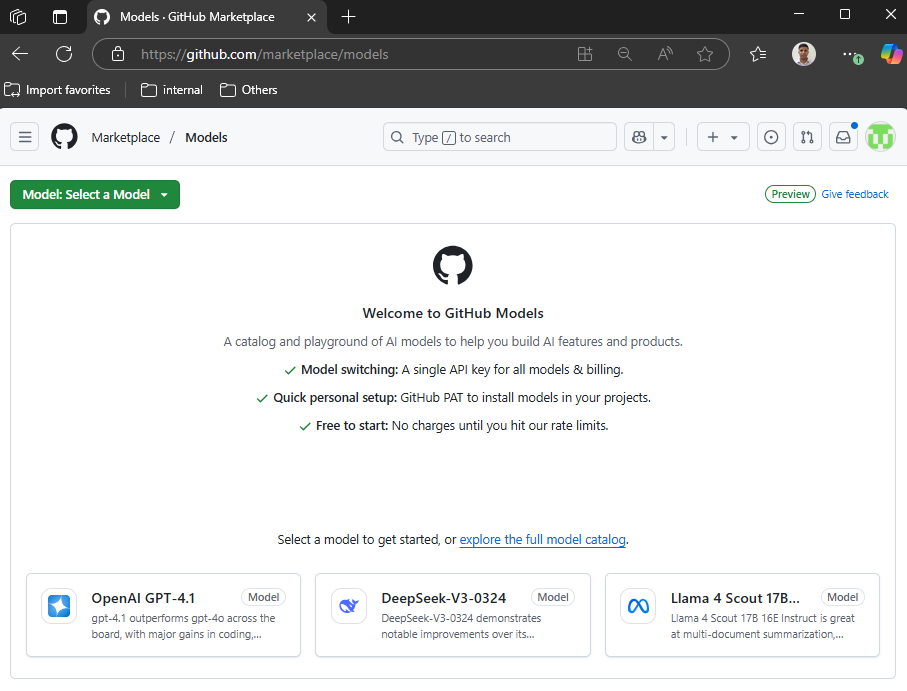

# Setting Up GitHub Models

In this guide, you will set up [GitHub Models](https://github.com/marketplace?type=models) to interact with Large Language Models (LLMs). GitHub Models are free and provide a great way to prototype and experiment with different LLMs. However, there are rate limits on usage. For more information, refer to the [Rate limits](https://docs.github.com/en/github-models/use-github-models/prototyping-with-ai-models#rate-limits).

1. From your browser, navigate to [GitHub Models Catalog](https://github.com/marketplace?type=models). You can chat with the models from the **Playground**. </br></br>
   
2. We will be interacting with the models from our own applications, so we need an API key to authenticate our requests. Follow these steps to get your API key:

    - From the **Playground**, select `gpt-4o` or any other chat completion model you want to use.
    - On the top right corner of the **Playground**, click on the **Use this model** button. This will open a pop-up window with API key options.
    - Select **Create Personal Access Token**. This will take you to the page to create Personal Access Token (PAT).
    - Click on **Generate new token**.
    - Give your token a name, like `agent-builder-workshop`.
    - Set the expiration to **No expiration** (or choose a suitable duration).
    - Under Permissions, navigate to Models and select  **Read-Only** access.
    - Click on **Generate token**. You will see a confirmation message with your new token.
    - Copy the generated token and save it securely. You will need this token to authenticate your requests.

3. Navigate to the code repository and run the following command to install the required packages:

    ```bash
    cp -r .env.example .env
    ```

4. Update the `.env` file with your GitHub Models API key:

    ```plaintext
    GITHUB_TOKEN=<your_github_models_api_key>
    ```

Note: The same token can be used for any models you choose to work with in the workshop.

---

👈 **[Back to Setup Instructions](../00-setup_instructions.md)**