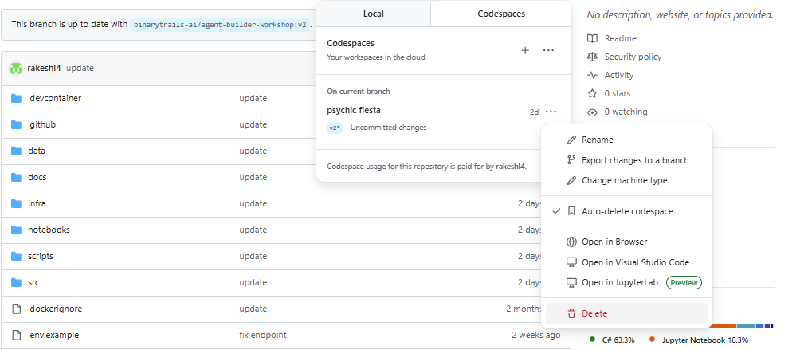

# Finishing Up

Congratulations on completing the workshop!🎉

Here are some final steps to wrap up your experience.

## Delete Azure Resources

To avoid ongoing charges, delete your Azure resource group.  

1. Open a terminal and navigate to the root of your project.
2. Run the following command.

    ```powershell
     azd down
    ```
   
   You can alternatively delete the resource group using the Azure Portal:

- Go to the [Azure Portal](https://portal.azure.com).  
- Click **Resource groups** in the left menu.  
- Select your resource group.  
- Click **Delete resource group**.

---

## Save Your Changes to GitHub  

If you have made changes to the workshop files, you can save them to your forked GitHub repository.

---

## Delete Your GitHub Codespace  

1. Go to [github.com/codespaces](https://github.com/codespaces).  
2. To the right of the codespace you want to delete, click ..., then click to  Delete.


---
