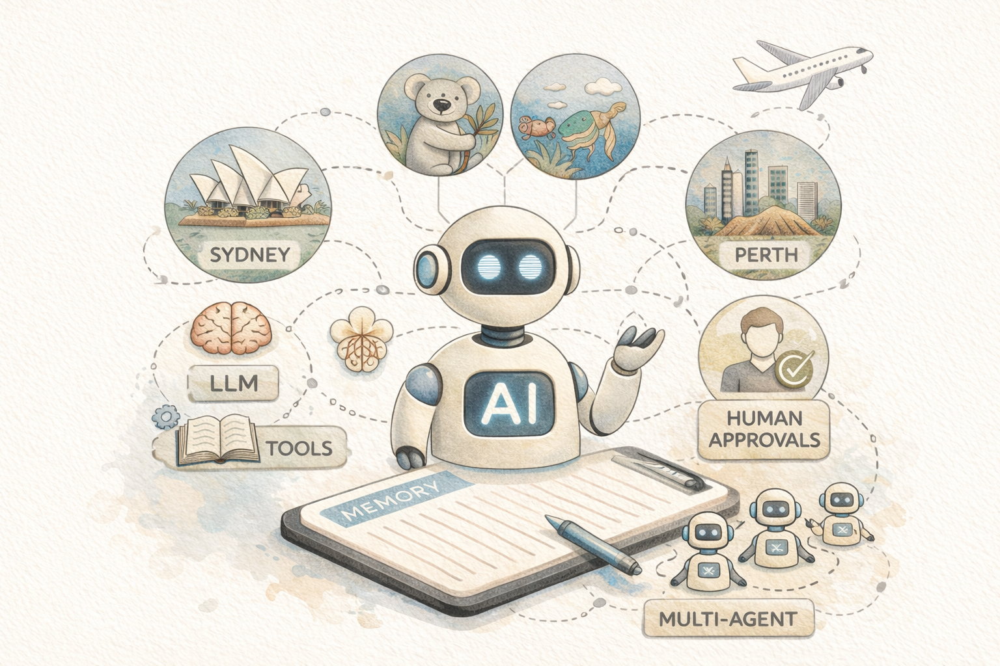

# Getting Started

Welcome to the AI Agent Builder Workshop!

In this hands-on workshop, you'll build **Travel Assistant**, an AI-powered agent that assists users plan trips, search flights, and provide personalized recommendations.

## What You'll Build

### Par 1: Foundation Labs

**Before You Start:** We highly recommend completing the foundation labs in the `labs/00-foundations` folder first. These labs cover the fundamental concepts of building agents with the Microsoft Agent Framework.

1. **[Lab 01: Basic Agent](../labs/00-foundations/lab01-basic-agent/README.md)** - Create your first AI-powered travel assistant with multi-turn conversations

2. **[Lab 02: Travel Assistant with Context](../labs/00-foundations/lab02-context/README.md)** - Enhance your agent by injecting additional context using `AIContextProvider`

3. **[Lab 03: Travel Assistant with RAG](../labs/00-foundations/lab03-rag/README.md)** - Implement Retrieval Augmented Generation (RAG) with semantic search over your own data

4. **[Lab 04: Long-Term Memory](../labs/00-foundations/lab04-longterm-memory/README.md)** - Add persistent user preferences across sessions with structured data extraction

5. **[Lab 05: Tools and Function Calling](../labs/00-foundations/lab05-tools/README.md)** - Add tools to your agent for dynamic information retrieval and actions

6. **[Lab 06: PII Filtering Middleware](../labs/00-foundations/lab06-middleware/README.md)** - Implement middleware to redact sensitive information from conversations

7. **[Lab 07: File-Based Agent Skills](../labs/00-foundations/lab07-skills/README.md)** - Use modular skill packages with progressive disclosure for scalable agent capabilities

8. **[Lab 08: Hosting Agents as Web Services](../labs/00-foundations/lab08-host/README.md)** - Host your agent as an ASP.NET Core web service with OpenAI-compatible endpoints

### Part 2: Hosted Agent with React UI

This workshop consists of five progressive labs, each building on the previous one:

1. [Lab 1: Remember Me - Personalization](./01-lab-personalization.md)
2. [Lab 2: Remember Everything — Memory](./02-lab-memory.md)
3. [Lab 3: Give It Superpowers — Tools](./03-lab-tools.md)
4. [Lab 4: Human-in-the-Loop — Approval workflows](./05-lab-human-approval.md)
5. [Lab 5: Specialist Team — Multi-agent collaboration](./06-lab-multi-agent.md)

## Technologies You'll Use

- **Microsoft Agent Framework** - SDK for building intelligent, context-aware agents with built-in support for orchestration, memory management, and tool integration.

- **Azure AI Foundry** - Used for accessing Azure OpenAI models for inference and generating embeddings.

- **Azure Cosmos DB** - NoSQL database service used for storing agent memory and application data.

- **.NET/C#** - Backend development of the agent's logic and API.

- **React** - Frontend development for the user interface.

- **OpenTelemetry** - A standard for observability, used for tracing and monitoring the agent's execution.

---

## Let's Get Started

Head over to the [Environment Setup](./00-setup_instructions.md) page for instructions on setting up your workshop environment.

Happy coding!
